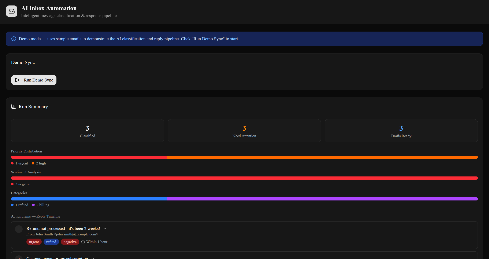
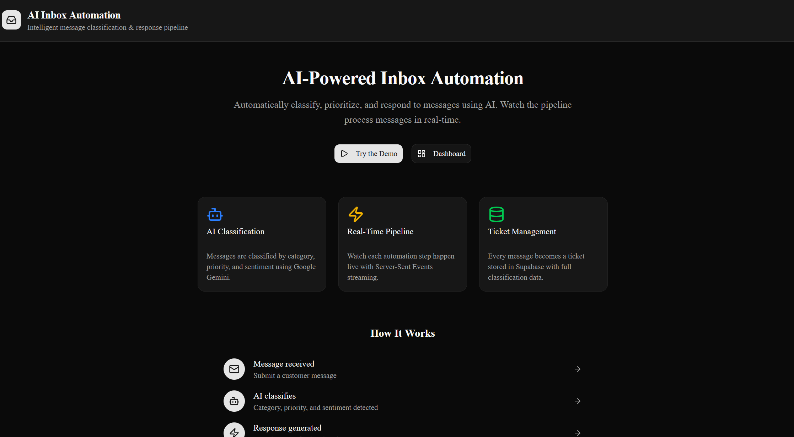
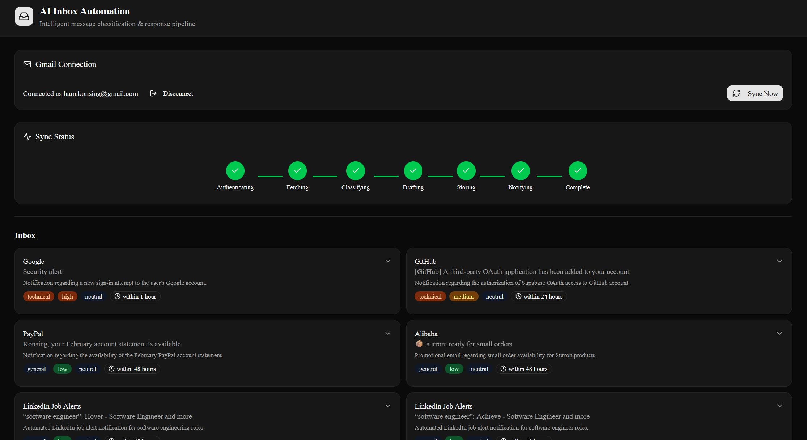
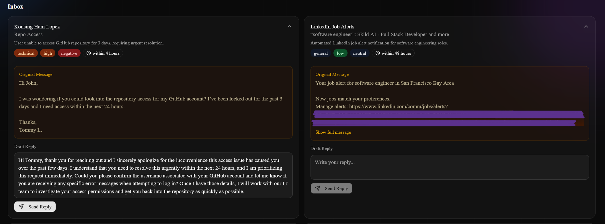
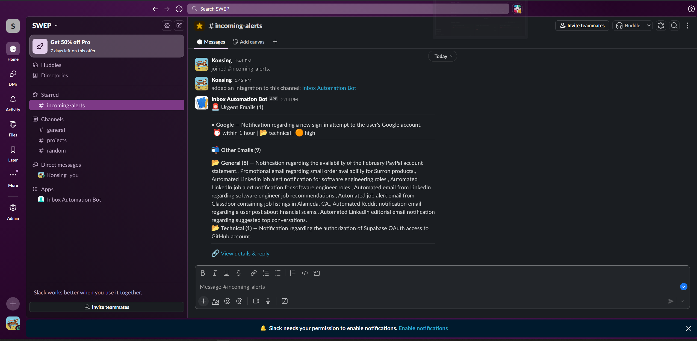
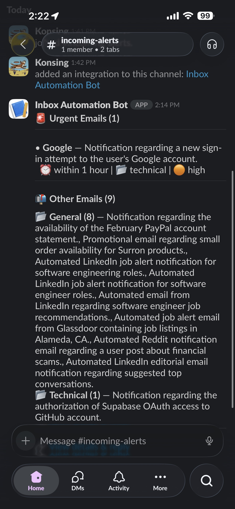

# AI Inbox Automation System

An AI-powered email classification and response pipeline with real-time visualization. Connects to Gmail, classifies emails using Google Gemini, generates draft replies, and posts Slack digests — all streaming live to the browser via Server-Sent Events.

**[Live Demo](https://inbox-automation-system.vercel.app)**

## Screenshots

<!-- Demo page: live activity feed with classification results -->


<!-- Landing page / home screen -->


<!-- Dashboard after syncing: classified emails with badges -->


<!-- AI-generated reply suggestion -->


<!-- Slack notifications -->
<p align="center">
  
  
</p>

## What It Does

```
Gmail Inbox                    Gemini AI                     Supabase
     |                             |                             |
     +-- Fetch unread emails ---->  |                             |
                                   +-- Classify (category,       |
                                   |   priority, sentiment)      |
                                   +-- Generate draft reply      |
                                   |                             |
                                   +-- Store results ----------> |
                                                                 |
     Slack <--------- Post digest summary                        |
     Browser <-------- SSE stream (real-time updates)            |
```

The system has two modes:

- **Demo** (`/demo`) — Runs 3 sample emails through the real AI pipeline with a live activity feed, classification badges, AI responses, run summary dashboard, and persistent history
- **Dashboard** (`/dashboard`) — Connects to your actual Gmail via OAuth, syncs unread emails, classifies them, generates draft replies for urgent/high priority, and posts a Slack digest

## Tech Stack

| Layer | Technology | Purpose |
|-------|-----------|---------|
| Framework | Next.js 16 (App Router) | Full-stack React with API routes |
| Styling | Tailwind CSS 4 + shadcn/ui | Dark mode UI components |
| AI | Google Gemini 3.1 Flash Lite | Classification + response in single API call |
| Email | Gmail API (OAuth 2.0) | Fetch unread emails, send replies |
| Database | Supabase (PostgreSQL) | Ticket and email storage with RLS |
| Notifications | Slack Incoming Webhooks | Block Kit digest messages |
| Auth | HMAC-SHA256 cookies + AES-256-GCM | Session signing + token encryption |
| Hosting | Vercel | Serverless deployment (free tier) |

## Architecture

```
Browser
  |
  |-- /demo ---------> POST /api/pipeline -----> Gemini (classify + respond)
  |                         |                         |
  |                         +-- SSE stream <----------+
  |                         +-- Store ticket -------> Supabase (tickets)
  |
  |-- /dashboard ----> POST /api/sync ----------> Gmail API (fetch unread)
  |                         |                         |
  |                         +-- Filter new emails --> Gemini (classify + respond)
  |                         +-- Store emails -------> Supabase (emails)
  |                         +-- Post digest --------> Slack Webhook
  |                         +-- SSE stream ---------> Browser
  |
  |-- Reply ---------> POST /api/reply ----------> Gmail API (send in thread)
```

Everything runs as a single Next.js application — no separate backend, no message queues, no workflow engine.

## How It Works

### Combined AI Call

Each email is processed in a **single Gemini API call** that returns both classification and a draft reply as structured JSON:

- **Category**: refund, billing, technical, general
- **Priority**: low, medium, high, urgent
- **Sentiment**: positive, neutral, negative
- **Summary**: one-line description (max 100 characters)
- **Reply deadline**: within 1 hour, 4 hours, 24 hours, or 48 hours
- **Draft reply**: professional response (2-3 paragraphs)

Uses Gemini's JSON schema mode (`responseMimeType: "application/json"`) to guarantee structured output — no parsing failures.

### Real-Time Streaming

Both pipelines use **async generators** that `yield` events at each step. These events are encoded as Server-Sent Events and streamed to the browser, driving animated visualizations as each step completes.

### Smart Sync

The production sync pipeline skips emails already classified in the database by querying existing `gmail_id`s before calling Gemini. Repeated syncs only classify genuinely new emails — no wasted API calls.

### Security

- OAuth tokens encrypted with **AES-256-GCM** at rest in Supabase
- Session cookies signed with **HMAC-SHA256** (httpOnly, Secure, SameSite=Lax)
- CSRF protection via OAuth `state` parameter stored in a short-lived cookie
- Row-level security on all production tables (service role only)
- Demo page password-protected

## Getting Started

### Prerequisites

- Node.js 18+
- [Supabase](https://supabase.com) account (free tier)
- [Google AI Studio](https://aistudio.google.com/apikey) API key (free)
- [Google Cloud Console](https://console.cloud.google.com) project (for Gmail OAuth)
- [Slack](https://api.slack.com/messaging/webhooks) incoming webhook (optional)

### Setup

1. **Clone and install**
   ```bash
   git clone https://github.com/Konsing/Inbox-Automation-System.git
   cd Inbox-Automation-System
   npm install
   ```

2. **Set up Supabase**
   - Create a new project at [supabase.com](https://supabase.com)
   - Go to SQL Editor and run both migrations:
     - `supabase/migrations/001_create_tickets.sql` (demo tickets table)
     - `supabase/migrations/002_create_accounts_emails.sql` (accounts + emails tables)
   - Copy your project URL and service role key from Project Settings > API

3. **Set up Google OAuth**
   - Create a project in [Google Cloud Console](https://console.cloud.google.com)
   - Enable the **Gmail API**
   - Configure OAuth consent screen (add your email as a test user)
   - Create OAuth 2.0 credentials with redirect URI:
     - Local: `http://localhost:3000/api/auth/google/callback`
     - Production: `https://your-app.vercel.app/api/auth/google/callback`

4. **Configure environment**
   ```bash
   cp .env.example .env.local
   ```

   Fill in your `.env.local`:
   ```bash
   # AI
   GEMINI_API_KEY=your_key

   # Database
   NEXT_PUBLIC_SUPABASE_URL=https://xxx.supabase.co
   SUPABASE_SERVICE_ROLE_KEY=your_key

   # Demo
   DEMO_PASSWORD=your_password

   # Google OAuth
   GOOGLE_CLIENT_ID=your_id
   GOOGLE_CLIENT_SECRET=your_secret
   GOOGLE_REDIRECT_URI=http://localhost:3000/api/auth/google/callback

   # Session (generate with: openssl rand -hex 32)
   SESSION_SECRET=your_secret

   # Slack (optional)
   SLACK_WEBHOOK_URL=https://hooks.slack.com/services/...

   # Site URL
   NEXT_PUBLIC_SITE_URL=http://localhost:3000
   ```

5. **Run**
   ```bash
   npm run dev
   ```
   Open [http://localhost:3000](http://localhost:3000)

## Project Structure

```
src/
├── app/
│   ├── page.tsx                    # Landing page
│   ├── layout.tsx                  # Root layout (global dark mode)
│   ├── demo/page.tsx               # Demo page with activity feed + summary
│   ├── dashboard/page.tsx          # Gmail dashboard with sync + email list
│   └── api/
│       ├── auth/route.ts           # POST — validate demo password
│       ├── auth/google/route.ts    # GET — initiate OAuth redirect
│       ├── auth/google/callback/   # GET — OAuth token exchange
│       ├── auth/session/route.ts   # GET/DELETE — session management
│       ├── pipeline/route.ts       # POST — SSE demo pipeline
│       ├── sync/route.ts           # POST — SSE Gmail sync pipeline
│       ├── tickets/route.ts        # GET — demo ticket history
│       ├── emails/route.ts         # GET — dashboard emails (filtered)
│       └── reply/route.ts          # POST — send reply via Gmail
├── components/
│   ├── header.tsx                  # App header with navigation
│   ├── password-gate.tsx           # Demo password protection
│   ├── google-sign-in.tsx          # OAuth sign-in button
│   ├── pipeline-step.tsx           # Animated step node (waiting/active/complete/error)
│   ├── sync-controls.tsx           # Sync button with cooldown
│   ├── sync-visualizer.tsx         # Sync pipeline progress display
│   ├── classification-badge.tsx    # Color-coded category/priority/sentiment badges
│   ├── email-card.tsx              # Expandable email with badges + reply editor
│   ├── email-list.tsx              # Email grid with filtering
│   └── reply-editor.tsx            # Editable draft reply with send button
├── hooks/
│   ├── use-pipeline-stream.ts      # SSE consumer for demo pipeline
│   ├── use-sync-stream.ts          # SSE consumer for sync pipeline
│   ├── use-session.ts              # Auth state hook
│   ├── use-emails.ts               # Email fetch + filter hook
│   └── use-tickets.ts              # Ticket history hook
└── lib/
    ├── pipeline.ts                 # Demo async generator (classify + respond)
    ├── sync-pipeline.ts            # Production async generator (Gmail → Gemini → DB → Slack)
    ├── gemini.ts                   # classifyAndRespond() + classifyAndRespondEmail()
    ├── gmail.ts                    # Gmail API client (fetch, send reply)
    ├── slack.ts                    # Slack Block Kit digest formatter
    ├── supabase.ts                 # Supabase client singleton
    ├── session.ts                  # Cookie management (HMAC-SHA256)
    ├── crypto.ts                   # AES-256-GCM token encryption
    ├── seed-emails.ts              # 8 sample emails for demo mode
    └── types.ts                    # Shared TypeScript types
```

## Deployment

1. Push to GitHub
2. Import the repo on [vercel.com](https://vercel.com)
3. Add all environment variables in Vercel dashboard (Settings > Environment Variables)
   - Set `GOOGLE_REDIRECT_URI` to your Vercel URL
   - Set `NEXT_PUBLIC_SITE_URL` to your Vercel URL
4. Deploy

## Free Tier Limits

| Service | Limit | Impact |
|---------|-------|--------|
| Vercel | 25s function timeout | Pipeline runs in ~3-8s |
| Gemini 3.1 Flash Lite | 15 RPM, 500 requests/day | ~166 demo runs/day |
| Supabase | 500MB database, 50K rows | Thousands of emails |
| Gmail API | 250 quota units/sec | Well within limits |
| Slack Webhooks | No rate limit for incoming | Unlimited digests |

## Future Plans

- **Automatic scheduled sync** — Cron job (via Vercel cron or external service) to automatically scan for new emails on a schedule (e.g. every hour)
- **Time-based email filtering** — Query only emails newer than the most recent one in the database using Gmail's `after:` filter, replacing the `is:unread` query for more precise incremental syncs
